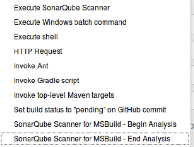
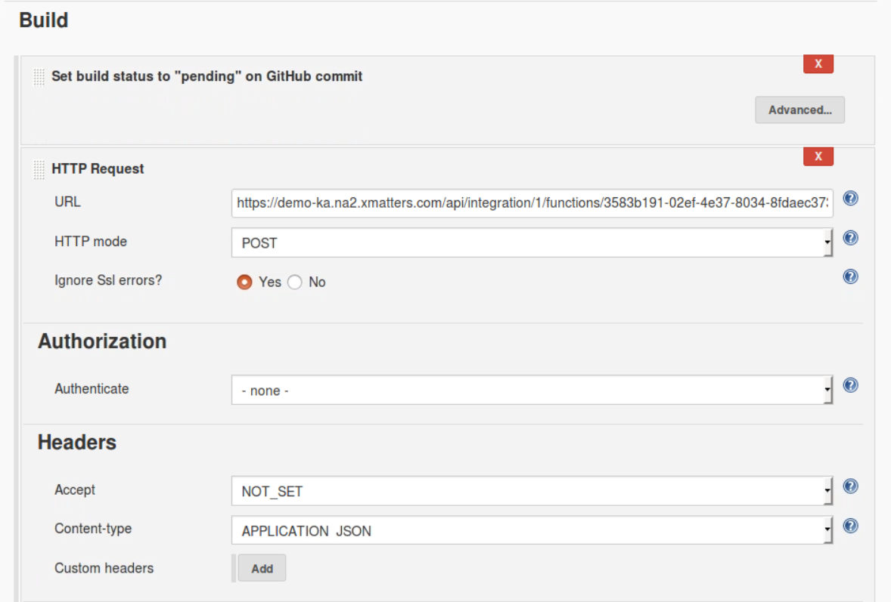
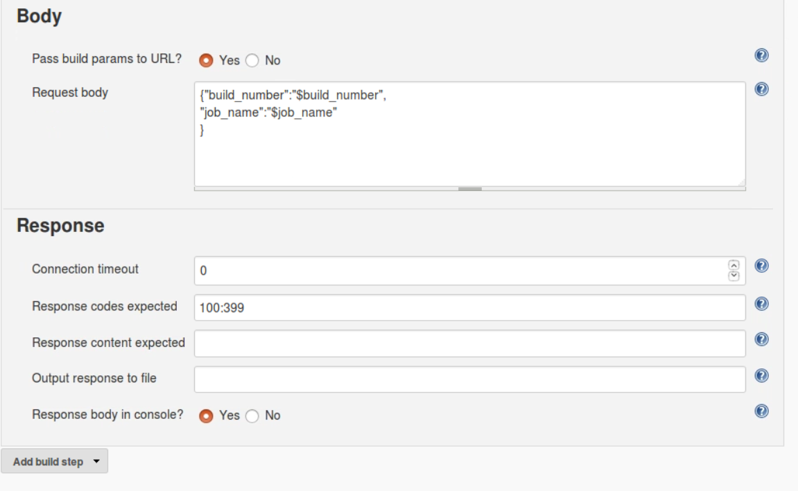
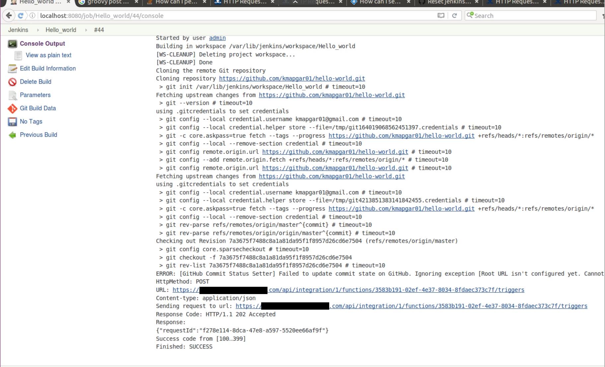
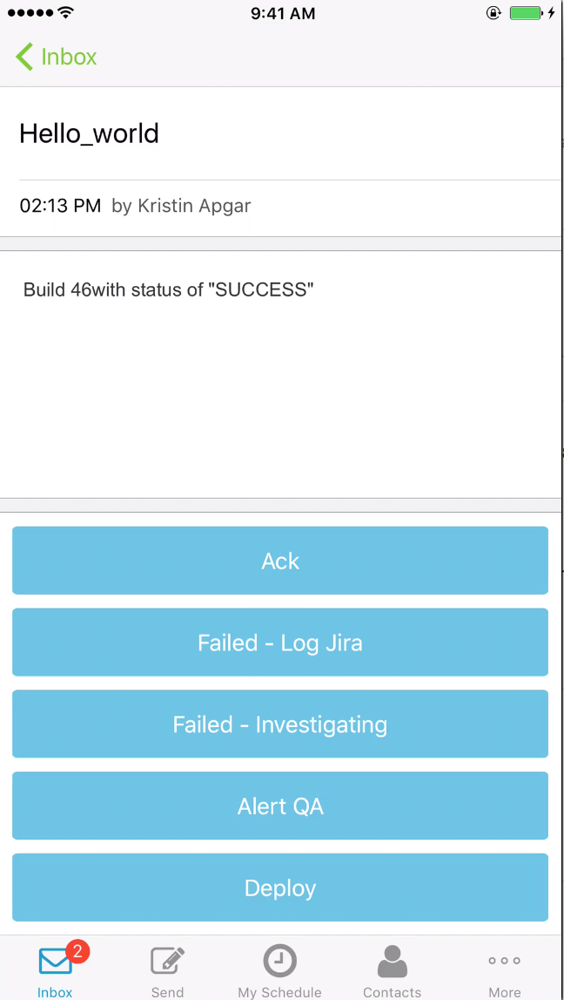

# Jenkins
The leading open source automation server, Jenkins provides hundreds of plugins to support building, deploying and automating any project. Check out a video of the integration in action [here](media/JenkinsBuild.mp4). 

# Pre-Requisites
* Jenkins Instance with the http_request plugin installed.
* xMatters account - If you don't have one, [get one](https://www.xmatters.com)!

# Files
* [JenkinsLibrary.js](JenkinsLibrary.js) - The javascript file to be pasted into a Shared Library. Jenkins is limited to pushing 3 or 4 environmental variables via the http_request plugin.  This library reaches back into Jenkins via a GET command to extract additional information about the build. 
* [JenkinsIB.js](JenkinsIB.js) - The javascript file to be pasted into the Inbound IB component.  This script calls the library.
* [Jenkins.zip](Jenkins.zip) - The Communication Plan (optional).  You can use this pre built communication plan and import it into your xMatters instance or create one from scratch. 

# Installation

## Jenkins set up
Install the Jenkins http_request plugin [Jenkins Http_Request Plugin](https://wiki.jenkins-ci.org/display/JENKINS/HTTP+Request+Plugin).  In Jenkins select a build and click on the Configure option.  In the configure option add a build step and select the Http_Request item.
<kbd>

</kbd>

Enter the information needed to point to xMatters in the build steps.
<kbd>

</kbd>
<kbd>

</kbd>

See the below list for the required information:

| Input | Value |
| ----- | ------|
| URL   | This in an xMatters Inbound Integration URL.  See instructions on how to create. [Inbound Integration](https://help.xmatters.com/OnDemand/xmodwelcome/integrationbuilder/build-integrations.htm) |
| HTTP mode | POST |
| Pass build params to URL| Yes |
| Request Body | JSON formated body of Jenkins Environmental values available to the http_plugin. [Jenkins Set Environment Variables](https://wiki.jenkins-ci.org/display/JENKINS/Building+a+software+project) |


## xMatters set up
**Option 1: Import the Comm Plan**
1. Import the [Jenkins.zip](Jenkins.zip) Communication Plan.  


**Option 2: Add the Jenkins code to an existing comm plan**
1. Navigate to the Integration Builder tab on an existing comm plan. 
2. Create a new Shared Library and add the code from the JenkinsLibrary.js file. 
3. Create an inbound or outbound integration and add the code from the JenkinsIB.js file.

**Complete the integration**
1. Click the Endpoints button and select the Jenkins endpoint. For help, see the [xMatters Endpoints](https://help.xmatters.com/OnDemand/xmodwelcome/integrationbuilder/configure-endpoints.htm) page. Update the base url and authentication information to reflect the Jenkins environment. 
2. Create a group in xMatters and add yourself to the group. For help, see the [xMatters Groups](https://help.xmatters.com/OnDemand/groups/groups.htm) page.  The name of the group can be changed in the Inbound IB script with these lines:
```javascript
// Define recipients
var recipients = [];
// Add a recipient targeting a user or group
recipients.push({
    'targetName': 'DevOps'
});
```
   
# Testing
Run a Build in Jenkins.  You should see in the console, Jenkins executing the HTTP_Request Build step and a status of 202.
<kbd>

</kbd>

A message should come through on your devices.  Which ever devices you have configured in xMatters.
<kbd>

</kbd>

# Troubleshooting
View xMatters Activity Stream to determine issues with Jenkins connectivity.
